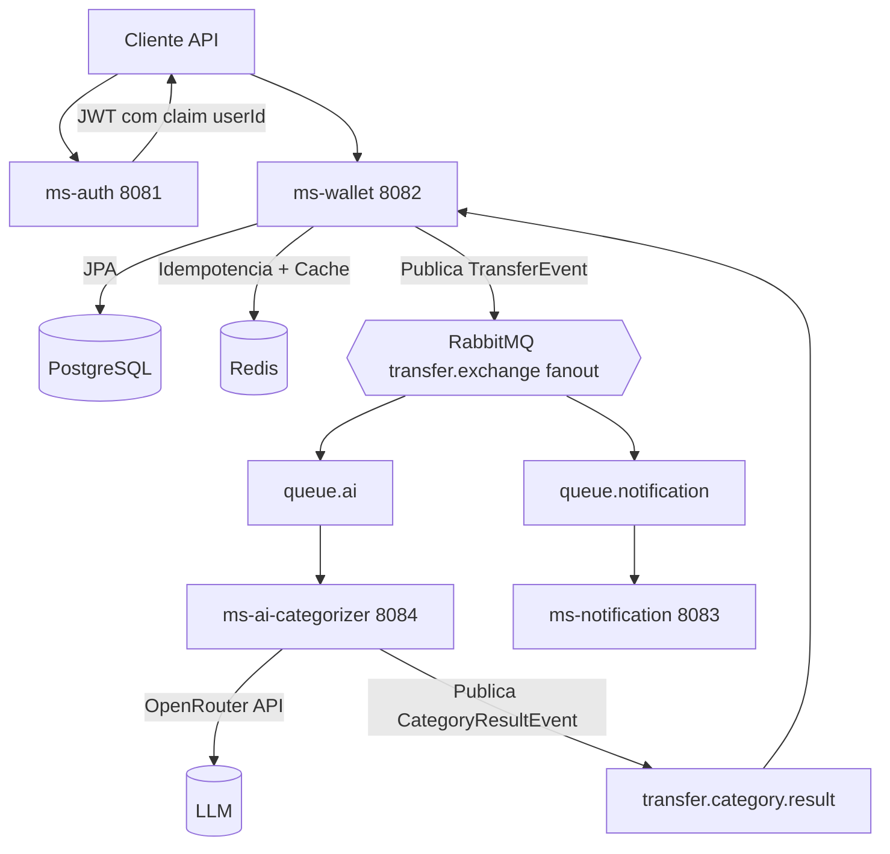

# PayFlow

Plataforma de pagamentos em arquitetura de microsservicos com foco em transferencias seguras, processamento assincrono e enriquecimento inteligente de dados com IA.

## Visao Geral

O PayFlow foi desenhado para simular um ambiente moderno de fintech, com separacao clara de responsabilidades entre servicos, autenticacao via JWT, processamento de carteira digital, mensageria orientada a eventos e categorizacao automatica de transacoes por IA.

Este repositorio contem quatro microsservicos Spring Boot:

- ms-auth: cadastro, login e emissao de token JWT.
- ms-wallet: carteira digital, transferencia entre usuarios, extrato e idempotencia.
- ms-ai-categorizer: classificacao automatica de transacoes usando OpenRouter.
- ms-notification: consumo de eventos para notificacoes.

A infraestrutura local e provisionada via Docker Compose com PostgreSQL, Redis, RabbitMQ e pgAdmin.

## Principais Destaques

- Arquitetura de microsservicos orientada a dominio.
- Seguranca stateless com Spring Security + JWT.
- Processamento assincrono de eventos com RabbitMQ.
- Categorizacao de transacoes com IA e fallback resiliente.
- Controle de idempotencia em transferencias com Redis.
- Cache de extrato para melhoria de desempenho.
- Tratamento global de excecoes com respostas padronizadas.

## Arquitetura



## Stack Tecnologica

- Java 21
- Spring Boot 3.5.13
- Spring Web
- Spring Data JPA
- Spring Security
- Spring Validation
- Spring AMQP (RabbitMQ)
- Spring Data Redis
- PostgreSQL
- Redis
- RabbitMQ
- Docker / Docker Compose
- Maven Wrapper

## Microsservicos em Detalhes

### 1. ms-auth (porta 8081)

Responsavel por autenticacao e autorizacao inicial.

**Responsabilidades:**

- Registro de usuario.
- Login com validacao de credenciais.
- Emissao de JWT com issuer payflow-ms-auth.
- Inclusao de claim userId no token.

**Endpoints:**

- POST /auth/register
- POST /auth/login

**Persistencia:**

- Tabela tb_users no PostgreSQL.

**Seguranca:**

- Endpoints de login e registro publicos.
- Demais rotas protegidas.

---

### 2. ms-wallet (porta 8082)

Nucleo de negocio financeiro do sistema.

**Responsabilidades:**

- Consulta/criacao automatica de carteira por usuario autenticado.
- Transferencia entre usuarios com validacoes de negocio.
- Prevencao de duplicidade por chave de idempotencia.
- Publicacao de evento da transferencia no RabbitMQ.
- Consulta de extrato com cache.
- Atualizacao de categoria da transacao apos retorno da IA.

**Endpoints protegidos por JWT:**

- GET /wallet
- POST /wallet/transfer
- GET /wallet/statement

**Regra de idempotencia:**

- Header obrigatorio: X-Idempotency-Key
- Chave armazenada no Redis com TTL de 5 minutos.

**Persistencia:**

- Tabela tb_wallets
- Tabela tb_transactions

---

### 3. ms-ai-categorizer (porta 8084)

Servico especializado em enriquecimento inteligente das transferencias.

**Responsabilidades:**

- Consumo de TransferEvent da fila queue.ai.
- Chamada ao provedor OpenRouter (modelo configuravel).
- Categorizacao textual para categorias de negocio.
- Publicacao do resultado em transfer.category.result.

**Resiliencia:**

- Em caso de erro no provedor de IA, aplica categoria OUTROS.

**Observacao:**

- Nao expoe endpoints REST de negocio; atua por eventos.

---

### 4. ms-notification (porta 8083)

Servico de notificacao baseado em eventos.

**Responsabilidades:**

- Consumo de TransferEvent da fila queue.notification.
- Validacao do evento recebido.
- Simulacao de envio de notificacao.

**Observacao:**

- Nao expoe endpoints REST de negocio; atua por eventos.

## Fluxo de Transferencia (Fim a Fim)

1. Cliente autentica no ms-auth e recebe JWT.
2. Cliente chama POST /wallet/transfer no ms-wallet com token + X-Idempotency-Key.
3. ms-wallet valida saldo e regras, persiste a transacao e publica TransferEvent em transfer.exchange.
4. ms-ai-categorizer consome o evento, chama a IA e publica CategoryResultEvent em transfer.category.result.
5. ms-wallet consome CategoryResultEvent e atualiza a categoria da transacao no ledger.
6. ms-notification consome o mesmo TransferEvent e processa notificacao.
7. Cliente consulta GET /wallet/statement e recebe extrato atualizado (com cache).

## Contratos de API (Exemplos)

### Registro

POST /auth/register

```json
{
  "name": "Maria Silva",
  "email": "maria@payflow.com",
  "password": "123456"
}
```

### Login

POST /auth/login

```json
{
  "email": "maria@payflow.com",
  "password": "123456"
}
```

Resposta:

```json
{
  "token": "jwt-token-aqui"
}
```

### Transferencia

POST /wallet/transfer

Headers:

- Authorization: Bearer <JWT>
- X-Idempotency-Key: 2cb5ad22-43f6-45cb-8a7a-44569bbf9111

Body:

```json
{
  "receiverId": "3c88d1f0-79ad-41e0-860a-6c87158ddf80",
  "value": 150.75,
  "description": "Jantar em restaurante"
}
```

Resposta:

```text
Transferencia realizada com sucesso
```

### Extrato

GET /wallet/statement

Header:

- Authorization: Bearer <JWT>

Resposta (exemplo):

```json
[
  {
    "transactionId": "b1e4d361-8d3f-47cc-96d4-169dd7edbf45",
    "senderId": "8fce0ff3-c05c-4d66-bd14-e4b8f6dbf0a5",
    "receiverId": "3c88d1f0-79ad-41e0-860a-6c87158ddf80",
    "amount": 150.75,
    "description": "Jantar em restaurante",
    "category": "ALIMENTACAO",
    "createdAt": "2026-03-29T11:32:10"
  }
]
```

## Padrao de Erro

Os servicos ms-auth e ms-wallet retornam um payload padrao para erros:

```json
{
  "timestamp": "2026-03-29T14:00:00Z",
  "status": 400,
  "error": "Bad Request",
  "message": "Dados invalidos",
  "path": "/wallet/transfer",
  "fieldErrors": {
    "value": "O valor minimo e 1 centavo"
  }
}
```

## Infraestrutura Local

Arquivo: docker-compose.yml

Servicos provisionados:

- PostgreSQL: 5432
- Redis: 6379
- RabbitMQ AMQP: 5672
- RabbitMQ Management: 15672
- pgAdmin: 8080

## Configuracao de Ambiente

O projeto utiliza variaveis de ambiente via arquivo .env na raiz.

### Variaveis esperadas

- DB_URL
- DB_USERNAME
- DB_PASSWORD
- RABBITMQ_USER
- RABBITMQ_PASSWORD
- RABBITMQ_HOST
- JWT_SECRET
- REDIS_HOST
- OPENROUTER_API_KEY

### Observacao importante de seguranca

Nunca publique chaves reais em repositorios publicos. Para GitHub, recomenda-se:

1. Criar um arquivo .env.example sem segredos.
2. Manter .env no .gitignore.
3. Rotacionar imediatamente qualquer chave que tenha sido exposta.

## Como Executar

### 1. Subir infraestrutura

Na raiz do projeto:

```bash
docker compose up -d
```

### 2. Subir os microsservicos

Em terminais separados, execute:

```bash
cd ms-auth
./mvnw spring-boot:run
```

```bash
cd ms-wallet
./mvnw spring-boot:run
```

```bash
cd ms-ai-categorizer
./mvnw spring-boot:run
```

```bash
cd ms-notification
./mvnw spring-boot:run
```

No Windows (cmd/powershell), use mvnw.cmd no lugar de ./mvnw.

### 3. Ordem recomendada

1. docker compose up -d
2. ms-auth
3. ms-wallet
4. ms-ai-categorizer
5. ms-notification

## Testes

Cada microsservico possui estrutura de testes Maven configurada.

Executar testes por servico:

```bash
cd ms-auth && ./mvnw test
cd ms-wallet && ./mvnw test
cd ms-ai-categorizer && ./mvnw test
cd ms-notification && ./mvnw test
```

## Estrutura do Repositorio

```text
payflow/
|- docker-compose.yml
|- .env
|- ms-auth/
|- ms-wallet/
|- ms-ai-categorizer/
|- ms-notification/
```

## Roadmap Sugerido

- Observabilidade com OpenTelemetry + Prometheus + Grafana.
- API Gateway para centralizar autenticacao e roteamento.
- CI/CD com build, testes e analise de qualidade automatica.
- Versionamento de schema com Flyway ou Liquibase.
- Testes de contrato entre produtores e consumidores de eventos.
- Notificacao real por e-mail (SMTP/provider).
- Limites transacionais e antifraude com regras avancadas.

## Contribuicao

Contribuicoes sao bem-vindas. Para colaborar:

1. Faça um fork do projeto.
2. Crie uma branch de feature.
3. Implemente e adicione testes.
4. Abra um Pull Request com descricao clara.

## Licenca

Defina aqui a licenca do projeto (ex: MIT) antes de publicar em producao.

## Autor

Projeto desenvolvido para estudo e evolucao de arquitetura de sistemas distribuidos com Spring Boot.
